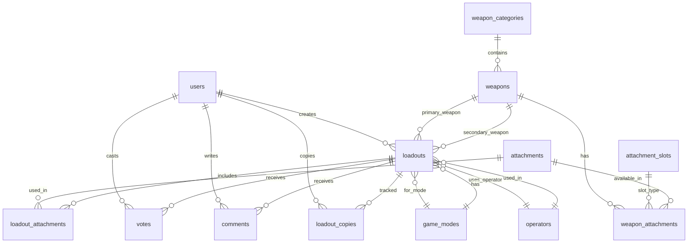

# Delta Force Loadout Hub — Implementation Plan

A community-driven platform for Delta Force players to share, discover, and rate weapon loadouts for **Warfare** and **Operations** game modes.

## Tech Stack

| Layer | Technology | Version | Rationale |
|-------|-----------|---------|-----------|
| Backend | **Laravel** | **13** (March 2026) | Latest stable, PHP Attributes, JSON:API, zero breaking changes |
| Frontend Interactivity | **Livewire** | **4.3** (May 2026) | Single-file components, `Route::livewire()`, `wire:transition` |
| Styling | **Tailwind CSS** | **v3** | Rapid dark-mode gaming aesthetic |
| Database | **MySQL 8** | via WAMP | Already available on your system |
| Auth | **Laravel Breeze** | Livewire stack | Auth scaffolding compatible with Livewire 4 |
| File Storage | **Laravel Filesystem** | local → S3 later | Screenshot/image uploads |
| Search | **Laravel Scout + MySQL fulltext** | Phase 1 → Meilisearch Phase 2 | Scalable search |
| PHP | **8.3+** | Required by Laravel 13 | Already on your system |

### Key Framework Features We'll Leverage

**Laravel 13:**
- PHP Attributes for model casts, validation rules, route middleware
- `Cache::touch()` for extending loadout view count TTL
- Native JSON:API resources for potential future API
- Improved queue routing for background jobs (image processing)

**Livewire 4:**
- **Single-File Components (SFC)** — PHP + Blade in one `.blade.php` file (default)
- **`Route::livewire()`** — Required routing method for full-page components
- **`pages::` / `layouts::` namespaces** — Structured component organization
- **`wire:transition`** — Built-in animations for dynamic content
- **Parallel requests** — `wire:model.live` and `wire:poll` no longer block each other
- **Scoped `<style>` tags** — Component-level CSS within SFCs

---

## User Review Required

> [!IMPORTANT]
> **Project Location**: I'll create the project at `C:\Users\HP\.gemini\antigravity\scratch\delta-force-hub`. Let me know if you prefer a different directory (e.g., `C:\Users\HP\Desktop\delta-force-hub`).

> [!IMPORTANT]
> **Authentication**: The plan uses email/password auth via Laravel Breeze. Discord OAuth login can be added in Phase 2. Is basic email auth OK for MVP?

> [!IMPORTANT]
> **Game Data Seeding**: I'll pre-populate the database with Delta Force weapon data (gun names, categories, attachments). This requires me to research the current weapon list. Should I use the publicly known weapon roster, or do you want to manually add weapons later through an admin panel?

> [!WARNING]
> **Scope Management**: The full feature list you described is a **massive** project. I've organized it into 3 phases. **Phase 1 (MVP)** is what I'll build first — it covers all core functionality. Do you want to proceed with Phase 1 only initially?

## Open Questions

1. **Project Directory** — Where should the Laravel project live? (`scratch` dir or Desktop?)
2. **Weapon Data** — Should I seed ~30-40 weapons with their attachment slots from public game data, or leave weapon management to an admin panel?
3. **Image Assets** — Should I generate placeholder weapon card images using AI, or use text-only cards for MVP?
4. **Deployment Target** — Any plans for hosting (shared hosting, VPS, Laravel Forge)? This affects some architectural choices.

---

## Database Schema



### Core Tables

#### `weapon_categories`
| Column | Type | Description |
|--------|------|-------------|
| id | bigint PK | |
| name | varchar(50) | Assault Rifle, SMG, Sniper, LMG, Shotgun, Marksman, Pistol |
| slug | varchar(50) | URL-friendly name |
| icon | varchar(100) | SVG icon path |
| display_order | int | Sort order |

#### `weapons`
| Column | Type | Description |
|--------|------|-------------|
| id | bigint PK | |
| weapon_category_id | bigint FK | Category reference |
| name | varchar(100) | CI-19, M4A1, AWM, etc. |
| slug | varchar(100) | URL-friendly |
| image | varchar(255) | Weapon image path |
| base_damage | int nullable | Base stats |
| fire_rate | int nullable | RPM |
| mobility | int nullable | Movement speed |
| is_secondary | boolean | Pistol/sidearm flag |

#### `attachment_slots`
| Column | Type | Description |
|--------|------|-------------|
| id | bigint PK | |
| name | varchar(50) | Barrel, Muzzle, Grip, Optic, Stock, Magazine, Laser, Underbarrel |
| slug | varchar(50) | |
| display_order | int | |

#### `attachments`
| Column | Type | Description |
|--------|------|-------------|
| id | bigint PK | |
| attachment_slot_id | bigint FK | Slot type |
| name | varchar(100) | Compensator, Vertical Grip, etc. |
| slug | varchar(100) | |
| description | text nullable | What it does |
| pros | text nullable | Benefits |
| cons | text nullable | Drawbacks |

#### `weapon_attachments` (pivot — which attachments fit which weapons)
| Column | Type | Description |
|--------|------|-------------|
| weapon_id | bigint FK | |
| attachment_id | bigint FK | |
| attachment_slot_id | bigint FK | Redundant but useful for queries |

#### `game_modes`
| Column | Type | Description |
|--------|------|-------------|
| id | bigint PK | |
| name | varchar(50) | Warfare, Operations |
| slug | varchar(50) | |
| description | text nullable | |

#### `operators`
| Column | Type | Description |
|--------|------|-------------|
| id | bigint PK | |
| name | varchar(100) | Operator name |
| class | enum | Assault, Recon, Support, Engineer |
| slug | varchar(100) | |
| image | varchar(255) nullable | |
| description | text nullable | |

#### `loadouts`
| Column | Type | Description |
|--------|------|-------------|
| id | bigint PK | |
| user_id | bigint FK | Creator |
| title | varchar(150) | "Meta CI-19 Build for Warfare" |
| slug | varchar(200) | URL-friendly unique |
| description | text | Build explanation |
| primary_weapon_id | bigint FK | Main weapon |
| secondary_weapon_id | bigint FK nullable | Sidearm |
| game_mode_id | bigint FK | Warfare or Operations |
| operator_id | bigint FK nullable | Selected operator |
| playstyle | enum | close_range, mid_range, long_range, all_rounder, stealth, budget, meta |
| loadout_code | text nullable | In-game import code |
| gadget_1 | varchar(100) nullable | |
| gadget_2 | varchar(100) nullable | |
| armor_type | varchar(100) nullable | |
| ammo_type | varchar(100) nullable | |
| screenshot | varchar(255) nullable | Uploaded image |
| video_url | varchar(255) nullable | YouTube/clip link |
| avg_kd | decimal(4,2) nullable | User-reported K/D |
| matches_tested | int default 0 | Matches used |
| is_meta | boolean default false | Community-voted meta |
| is_featured | boolean default false | Admin-featured |
| views_count | int default 0 | View counter |
| copies_count | int default 0 | How many copied |
| vote_score | int default 0 | Cached upvote−downvote |
| status | enum | draft, published, archived |
| published_at | timestamp nullable | |
| timestamps | | created_at, updated_at |

#### `loadout_attachments` (pivot — attachments on a specific loadout)
| Column | Type | Description |
|--------|------|-------------|
| loadout_id | bigint FK | |
| attachment_id | bigint FK | |
| attachment_slot_id | bigint FK | Which slot |
| weapon_type | enum('primary','secondary') | For which weapon |

#### `votes`
| Column | Type | Description |
|--------|------|-------------|
| id | bigint PK | |
| user_id | bigint FK | |
| loadout_id | bigint FK | |
| value | tinyint | +1 or −1 |
| unique(user_id, loadout_id) | | One vote per user |

#### `comments`
| Column | Type | Description |
|--------|------|-------------|
| id | bigint PK | |
| user_id | bigint FK | |
| loadout_id | bigint FK | |
| parent_id | bigint FK nullable | For threaded replies |
| body | text | Comment text |
| is_verified | boolean default false | "I tested this" badge |
| timestamps | | |

#### `loadout_copies`
| Column | Type | Description |
|--------|------|-------------|
| id | bigint PK | |
| user_id | bigint FK | Who copied |
| loadout_id | bigint FK | What was copied |
| created_at | timestamp | |

---

## Proposed Changes

### Phase 1 — MVP (Core Platform) 🎯

This is what I'll build. Estimated: ~15 Livewire SFCs, ~12 models, ~10 migrations.

---

### 1. Project Scaffold

#### [NEW] Laravel 13 project initialization
```bash
composer create-project laravel/laravel delta-force-hub
cd delta-force-hub
composer require livewire/livewire  # v4.3
php artisan breeze:install livewire  # Livewire 4 compatible Breeze
npm install && npm run build
```

#### [NEW] `tailwind.config.js`
- Custom color palette: military greens, tactical oranges, dark grays, accent golds
- Custom fonts: **Rajdhani** or **Exo 2** (gaming-style headings) + **Inter** for body
- Custom animations: slide-in, pulse-glow, card-hover, weapon-reveal

#### [NEW] `resources/css/app.css`
- Global dark theme variables (CSS custom properties)
- Gaming-aesthetic utility classes
- Glassmorphism card panels with military styling
- Custom scrollbar, neon accent glows
- Responsive breakpoints for mobile-first

---

### 2. Database & Models

#### [NEW] Migrations (10 files)
All tables listed in the schema above, with proper foreign keys, indexes, and cascading deletes.

#### [NEW] Models (12 files) — Using Laravel 13 PHP Attributes
```php
// Example: Loadout model using Laravel 13 Attributes
class Loadout extends Model
{
    #[Cast('array')]   // Laravel 13 attribute-based casting
    protected $gadgets;

    #[ScopedBy(PublishedScope::class)]  // Attribute-based scopes
    // ...
}
```

- `WeaponCategory` — hasMany weapons
- `Weapon` — belongsTo category, belongsToMany attachments
- `AttachmentSlot` — hasMany attachments
- `Attachment` — belongsTo slot, belongsToMany weapons
- `GameMode` — hasMany loadouts
- `Operator` — hasMany loadouts
- `Loadout` — belongsTo user/weapon/mode/operator, hasMany votes/comments
- `LoadoutAttachment` — pivot model
- `Vote` — belongsTo user & loadout
- `Comment` — belongsTo user & loadout, self-referencing for threads
- `LoadoutCopy` — belongsTo user & loadout

#### [NEW] Seeders (7 files)
- `WeaponCategorySeeder` — 7 categories (AR, SMG, Sniper, LMG, Shotgun, Marksman, Pistol)
- `WeaponSeeder` — ~30-40 weapons with base stats
- `AttachmentSlotSeeder` — 8 slots
- `AttachmentSeeder` — ~60-80 common attachments
- `GameModeSeeder` — Warfare, Operations
- `OperatorSeeder` — Known operators with classes
- `DemoLoadoutSeeder` — 10-15 sample loadouts for demo

---

### 3. Livewire 4 Single-File Components (Pages)

All page components use Livewire 4's **single-file component** pattern with `Route::livewire()` routing.

#### [NEW] `resources/views/pages/home.blade.php` (SFC)
**Homepage** — The main landing page:
```php
<?php
// Single-File Component: PHP + Blade in one file
use Livewire\Volt\Component;

new class extends Component {
    public function with(): array {
        return [
            'trending' => Loadout::trending()->take(8)->get(),
            'warfareHot' => Loadout::forMode('warfare')->popular()->take(4)->get(),
            'operationsHot' => Loadout::forMode('operations')->popular()->take(4)->get(),
            'stats' => [...],
        ];
    }
};
?>
```
- Hero section with animated weapon silhouette and tagline
- "Trending Loadouts" carousel (top voted this week)
- "Hot in Warfare" / "Hot in Operations" sections with `wire:transition`
- Quick weapon category cards (click to browse by category)
- Recent uploads feed
- Stats bar: total loadouts, users, copies

#### [NEW] `resources/views/pages/loadouts/browse.blade.php` (SFC)
**Browse & Search Page** — Core discovery experience:
- Full-text search bar with debounced `wire:model.live` (non-blocking in LW4)
- Filter sidebar: weapon category, specific weapon, game mode, playstyle, operator class
- Sort by: popular, newest, top-rated, most-copied
- Loadout card grid with pagination
- Active filter chips with clear buttons
- `wire:transition` on card appearance/disappearance
- "No results" state with suggestions

#### [NEW] `resources/views/pages/loadouts/show.blade.php` (SFC)
**Single Loadout View**:
- Hero card with weapon name + title + creator avatar
- Attachment breakdown with slot labels and visual layout
- Loadout code display with "Copy Code" button (clipboard API)
- Stats section (K/D, matches tested, views, copies)
- Vote component (inline)
- Screenshot/video embed (YouTube iframe or image lightbox)
- Comments section with reply threading
- "Copy to My Library" button
- Share buttons (copy link, Discord-formatted text)
- Related loadouts sidebar (same weapon, same mode)

#### [NEW] `resources/views/pages/loadouts/create.blade.php` (SFC)
**Create/Edit Loadout Form** — Multi-step or single-page:
1. Pick game mode (Warfare / Operations) — radio cards
2. Select primary weapon (grouped by category, searchable dropdown)
3. Dynamic attachment slots (loaded based on selected weapon)
4. Select each attachment per slot (cascading selects)
5. Secondary weapon + its attachments (optional)
6. Operator, gadgets, armor, ammo type fields
7. Title, description, playstyle tag picker
8. Paste loadout code (textarea)
9. Upload screenshot / paste video URL
10. Optional: K/D stats and matches tested
- Real-time validation with `wire:model.live`
- Preview card before publishing
- Draft save functionality

#### [NEW] `resources/views/pages/profile/show.blade.php` (SFC)
**User Profile**:
- Avatar, username, bio, favorite operator badge
- Stats: total uploads, total votes received, total copies
- Tabbed content: My Loadouts, Copied Loadouts
- Loadout grid with same card components

#### [NEW] `resources/views/pages/weapons/show.blade.php` (SFC)
**Single Weapon Page**:
- Weapon stats display (damage, fire rate, mobility bars)
- All loadouts for this weapon (filterable by mode)
- Most popular attachments for this weapon (bar chart or ranked list)
- Community meta consensus indicator

#### [NEW] `resources/views/pages/weapons/index.blade.php` (SFC)
**Weapon Browser**:
- Category filter tabs (AR, SMG, Sniper, etc.)
- Weapon cards in grid layout with stats preview
- Click to see weapon detail page

---

### 4. Livewire 4 Reusable Components

These are embedded components used across multiple pages.

#### [NEW] `resources/views/components/loadout-card.blade.php` (SFC)
**Reusable Loadout Card** — Used in browse, home, profile:
- Weapon name + category badge
- Creator avatar + username
- Game mode badge (color-coded: Warfare=green, Operations=orange)
- Playstyle tag pill
- Vote score + copy count
- Hover expand with quick-view attachment list
- `wire:transition` for smooth entry animations

#### [NEW] `resources/views/components/vote-button.blade.php` (SFC)
- Upvote/downvote arrows with optimistic UI
- Auth gate (prompt login modal if not authenticated)
- Live vote count update via `wire:model.live`
- Scoped `<style>` for button glow effects

#### [NEW] `resources/views/components/comment-section.blade.php` (SFC)
- Threaded comments with reply toggle
- "I tested this ✓" verification toggle
- Delete own comments
- Sort by newest / top voted
- `wire:transition` for new comment appearance

#### [NEW] `resources/views/components/weapon-selector.blade.php` (SFC)
- Searchable dropdown grouped by weapon category
- Shows weapon name + category tag
- Fires Livewire event when selected → triggers attachment slot loading

#### [NEW] `resources/views/components/attachment-picker.blade.php` (SFC)
- Dynamic per-slot attachment selector
- Only shows attachments compatible with selected weapon
- Visual slot layout (vertical list with slot labels)
- "None" option for each slot

#### [NEW] `resources/views/components/search-bar.blade.php` (SFC)
- Debounced search input with `wire:model.live.debounce.300ms`
- Autocomplete dropdown (weapons + loadout titles)
- Keyboard navigation (arrow keys + enter)
- Recent searches stored in localStorage

#### [NEW] `resources/views/components/filter-sidebar.blade.php` (SFC)
- Collapsible filter groups with `wire:transition`
- Checkbox groups for weapon categories
- Radio buttons for game mode
- Playstyle tag selector (pill buttons)
- Sort dropdown
- "Clear All" / "Apply" buttons
- Mobile: slide-in drawer

#### [NEW] `resources/views/components/stats-bar.blade.php` (SFC)
- Animated counters for site-wide stats
- Total loadouts, users, copies this week
- Uses `wire:poll.30s` for live updates

---

### 5. Layouts

#### [NEW] `resources/views/layouts/app.blade.php`
- Dark theme navbar:
  - Logo + **"DELTA FORCE HUB"** branding (military stencil font)
  - Nav links: Home, Browse, Create Loadout, Weapons
  - Compact search bar
  - Auth buttons or user avatar dropdown
- Sticky nav on scroll with backdrop blur
- Mobile hamburger menu with slide-in drawer
- Footer: links, credits, "Built for the DF community"
- Toast notification area (for "Loadout copied!" etc.)

#### [NEW] `resources/views/layouts/guest.blade.php`
- Minimal centered layout for login/register
- Same dark gaming aesthetic with subtle background pattern

---

### 6. Routes — Using `Route::livewire()`

```php
// routes/web.php — Livewire 4 routing syntax

use Illuminate\Support\Facades\Route;

// Public pages
Route::livewire('/', 'pages::home')->name('home');
Route::livewire('/loadouts', 'pages::loadouts.browse')->name('loadouts.browse');
Route::livewire('/loadouts/{loadout:slug}', 'pages::loadouts.show')->name('loadouts.show');
Route::livewire('/weapons', 'pages::weapons.index')->name('weapons.index');
Route::livewire('/weapons/{weapon:slug}', 'pages::weapons.show')->name('weapons.show');
Route::livewire('/user/{user:username}', 'pages::profile.show')->name('profile.show');

// Auth-required pages
Route::middleware('auth')->group(function () {
    Route::livewire('/loadouts/create', 'pages::loadouts.create')->name('loadouts.create');
    Route::livewire('/loadouts/{loadout:slug}/edit', 'pages::loadouts.create')->name('loadouts.edit');
    Route::livewire('/dashboard', 'pages::dashboard')->name('dashboard');
    Route::livewire('/profile/edit', 'pages::profile.edit')->name('profile.edit');
});
```

---

### Phase 2 — Community Features (After MVP)

- Discord OAuth login (Socialite)
- Follow creators / notification system
- "Meta" community voting system and tier lists
- Advanced search with Meilisearch integration
- Share-to-Discord/X with generated image cards (Intervention Image)
- Embeddable loadout widget (iframe)
- Admin moderation panel (approve/flag/delete loadouts)
- Report system for bad content
- Livewire Islands for lazy-loading heavy sections

### Phase 3 — Advanced Tools (Future)

- Attachment guides per weapon (pros/cons database)
- Budget builder tool (select price range → get suggestions)
- Patch notes tracker / meta change log
- Analytics dashboard (most copied guns, trending attachments)
- Leaderboard for top contributors
- Premium features (custom profiles, ad-free, early meta access)
- "Loadout of the Week" contests with community voting
- JSON:API endpoint for third-party integrations (using Laravel 13 native JSON:API)

---

## Verification Plan

### Automated Tests
```bash
# Run full test suite
php artisan test

# Key test areas:
# - Loadout CRUD (create, read, update, delete)
# - Vote toggling (up/down/remove)
# - Search & filter queries return correct results
# - Auth gates (unauthenticated users can't create loadouts)
# - Slug generation uniqueness
# - Comment threading (parent/child relationships)
# - Attachment compatibility validation
```

### Manual Verification
- Browse the site at `http://localhost:8000`
- Create a loadout end-to-end (full form flow)
- Test search with various gun names and filters
- Test voting up/down and score changes
- Verify mobile responsiveness at 375px, 768px, 1024px
- Test all filter combinations in browse page
- Verify seeded demo data displays correctly
- Test loadout code copy-to-clipboard

### Browser Testing
- Visual check of dark theme consistency across all pages
- Card hover animations and `wire:transition` effects
- Mobile menu toggle and drawer behavior
- Form wizard flow and validation feedback
- Screenshot upload preview rendering
- Page load performance with seeded data

---

## File Structure Overview (Livewire 4 Convention)

```
delta-force-hub/
├── app/
│   └── Models/
│       ├── WeaponCategory.php
│       ├── Weapon.php
│       ├── AttachmentSlot.php
│       ├── Attachment.php
│       ├── GameMode.php
│       ├── Operator.php
│       ├── Loadout.php
│       ├── LoadoutAttachment.php
│       ├── Vote.php
│       ├── Comment.php
│       └── LoadoutCopy.php
├── database/
│   ├── migrations/          (10 migration files)
│   └── seeders/             (7 seeder files + DatabaseSeeder)
├── resources/views/
│   ├── layouts/             (Livewire 4 layouts:: namespace)
│   │   ├── app.blade.php    (main dark gaming layout)
│   │   └── guest.blade.php  (auth pages layout)
│   ├── pages/               (Livewire 4 pages:: namespace — SFCs)
│   │   ├── home.blade.php
│   │   ├── dashboard.blade.php
│   │   ├── loadouts/
│   │   │   ├── browse.blade.php
│   │   │   ├── show.blade.php
│   │   │   └── create.blade.php
│   │   ├── weapons/
│   │   │   ├── index.blade.php
│   │   │   └── show.blade.php
│   │   └── profile/
│   │       ├── show.blade.php
│   │       └── edit.blade.php
│   └── components/          (reusable SFC components)
│       ├── loadout-card.blade.php
│       ├── vote-button.blade.php
│       ├── comment-section.blade.php
│       ├── weapon-selector.blade.php
│       ├── attachment-picker.blade.php
│       ├── search-bar.blade.php
│       ├── filter-sidebar.blade.php
│       └── stats-bar.blade.php
├── routes/web.php           (Route::livewire() definitions)
├── tailwind.config.js       (dark gaming theme)
└── resources/css/app.css    (global dark theme styles)
```
